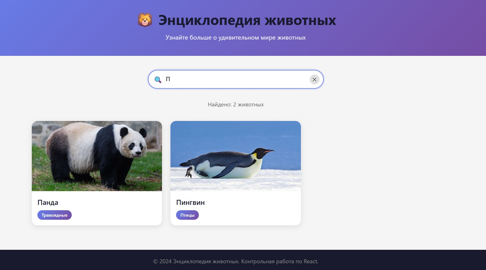

# 🦁 Энциклопедия животных

React-приложение для просмотра информации о различных животных.

## 📋 Описание

Приложение представляет собой интерактивную энциклопедию животных с возможностью:
- Просмотра карточек животных с фотографиями и названиями
- Поиска животных по названию (на русском и английском языке)
- Просмотра детальной информации о каждом животном в модальном окне

## 🛠️ Технологии

- **React 19** — библиотека для создания пользовательских интерфейсов
- **Vite** — сборщик проекта
- **CSS3** — стилизация компонентов
- **ESLint** — линтер для проверки кода

## 📁 Структура проекта

```
src/
├── components/
│   ├── AnimalCard.jsx      # Компонент карточки животного
│   ├── AnimalCard.css
│   ├── AnimalList.jsx      # Компонент списка карточек
│   ├── AnimalList.css
│   ├── AnimalModal.jsx     # Модальное окно с деталями
│   ├── AnimalModal.css
│   ├── SearchBar.jsx       # Компонент поиска
│   └── SearchBar.css
├── data/
│   └── animals.js          # Данные о животных
├── App.jsx                 # Главный компонент
├── App.css
├── main.jsx               # Точка входа
└── index.css              # Глобальные стили
```

## 🖼️ Скриншоты

### Главная страница


### Поиск животных


### Детальная информация о животном


